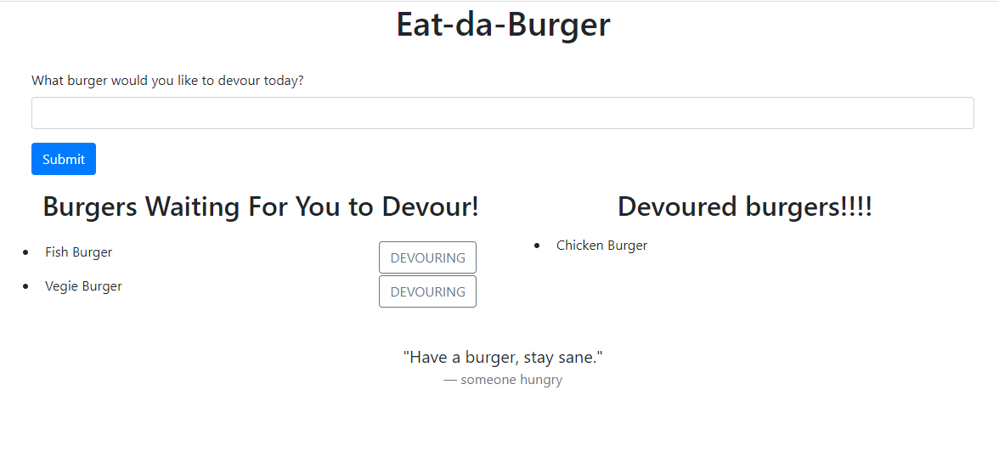

# eat-da-burgers

## Description

This is an application that allows a user to input their list of burgers they'd like to consume and subsequently devour those burgers.

The technologies used to create the application include:

- Javascript
- Node.js
- Express.js
- Heroku

## Instructions

Once you've cloned the repository from GitHub, you'll want to open the file server.js within the Terminal and run "npm install" in order to install all dependencies. Once completed, the node_modules will have been instaled and you'll able to run the server.js file.

## Deployment

This application has been deployed across Heroku, you can view this here:

## Preview of the Application

